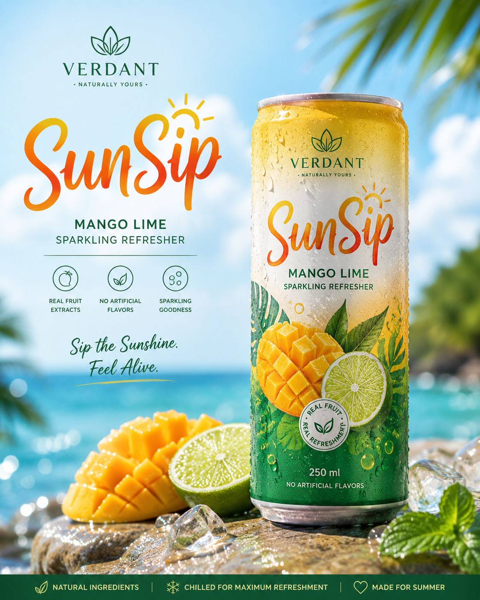
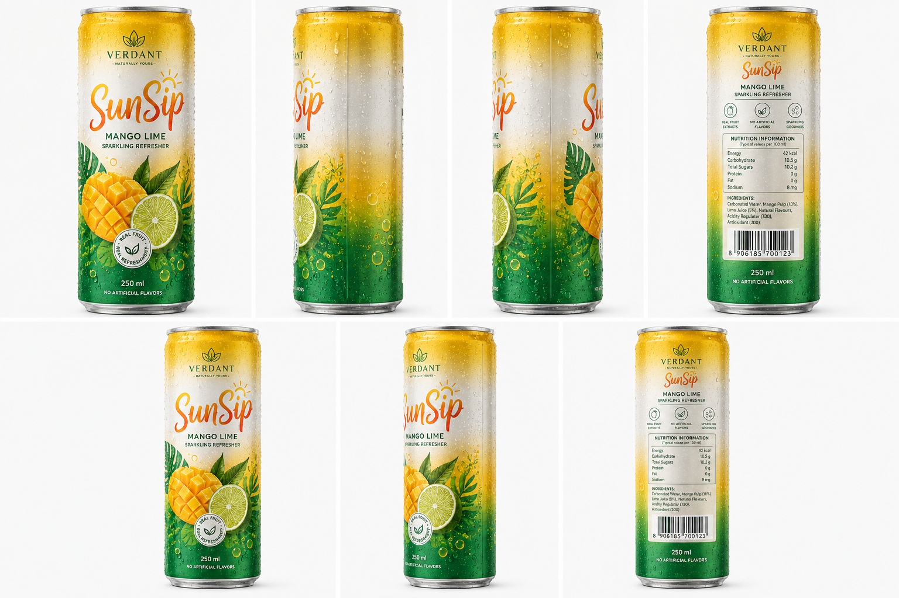
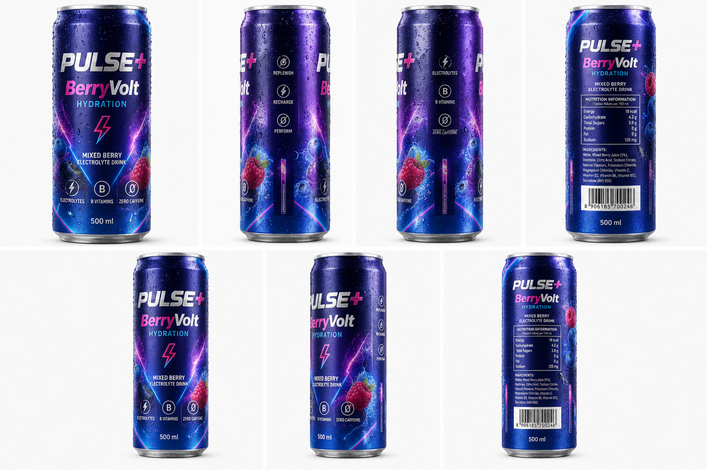
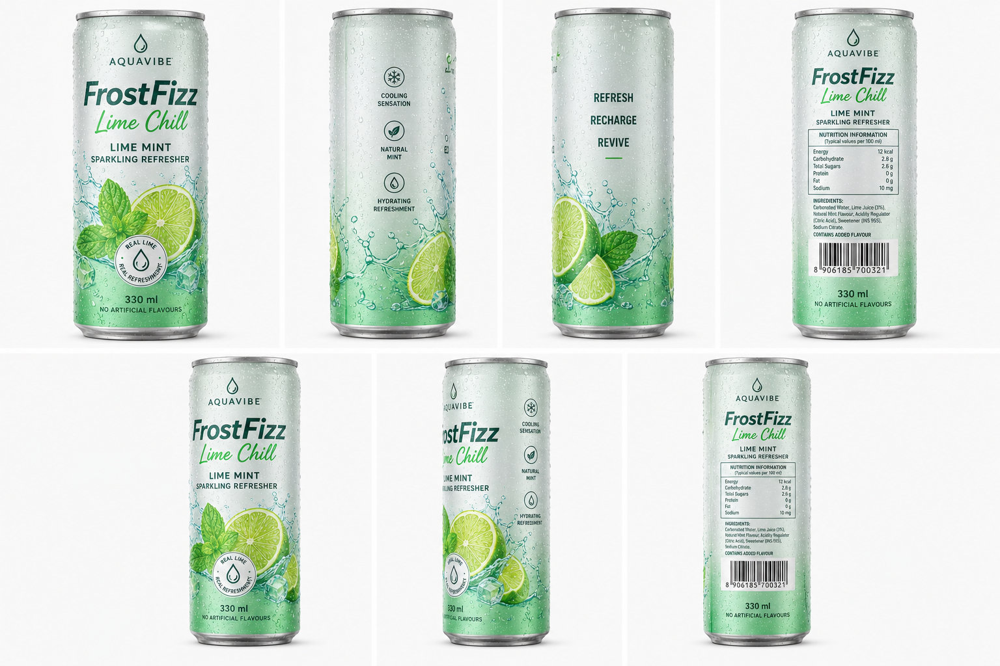

# 🥤 Summer Drink Visualization & Brand Variations

A comprehensive exploration of beverage packaging design, brand consistency, and marketing visualization.

## 📸 Original Concept: The Summer Drink
**Prompt used for creating an attractive picture with Chatgpt:**
> Create a picture of a summer drink packed in a can which looks attractive in terms of packaging and refreshing to drink, Choose an attractive name of the drink and brand name associated to it.

**Result:** 

---

## 🛠️ First Variation: Tropical Mango Energy Drink
### 📝 Professional Packaging Reference Sheet
**Prompt used:**
> Create a professional beverage packaging reference sheet of the exact same drink as attached, can design shown consistently across all panels, plain pure attractive background. 
> The sheet is divided into two rows.
> Top row contains four equally sized close-up can views side by side:
> 1. Front label view
> 2. Left side view
> 3. Right side view
> 4. Back label/nutrition view
> Bottom row contains three equally sized perspective product shots side by side:
> 1. Full can front perspective
> 2. Three-quarter angled perspective
> 3. Full can back perspective
> Replicate every packaging detail exactly across all panels:
> exact same logo placement,
> same typography,
> same metallic texture,
> same condensation droplets,
> same reflections,
> same aluminum material finish,
> same pull-tab color,
> same lighting behavior,
> same ingredient graphics,
> same fruit illustrations,
> same branding consistency,
> same proportions,
> same label alignment.
>
> Ultra realistic beverage advertisement photography.
> Cold refreshing appearance with visible condensation and water droplets.
> Photorealistic aluminum texture with micro scratches and realistic reflections.
> Studio product photography lighting.
> Soft neutral lighting.
> Flat even shadows.
> No background props.
> No additional objects.
> No environmental distractions.
> Perfectly centered composition.
>
> Shot on Hasselblad X2D 100C.
> RAW photograph quality.
> Ultra sharp micro-detail.
> Commercial beverage branding presentation.
> Packaging mockup sheet.
> Orthographic packaging reference.
> Luxury FMCG product visualization.
> High-end energy drink / sparkling drink advertising style.

### ✨ Variation 1 Details
* **Flavor Variant:** Mango Blast Sparkling Energy Drink
* **Brand Name:** VERDANT
* **Drink Name:** SunSip Mango Rush
* **Color Palette:** Sunset orange, tropical yellow, lime green, white accents
* **Can Design Details:** Tall slim aluminum can. Gradient yellow-to-green metallic finish. Fresh mango illustrations with sliced lime graphics. Minimal modern typography. Glossy UV printed logo. Tiny sparkling bubble graphics around the fruit. Natural energy iconography. Premium tropical summer branding. 250ml marking near bottom.

**Result:** 

---

## ⚡ Second Variation: Berry Electrolyte Summer Drink
### ✨ Variation 2 Details
* **Flavor Variant:** Mixed Berry Electrolyte Drink
* **Brand Name:** PULSE+
* **Drink Name:** BerryVolt Hydration
* **Color Palette:** Deep berry purple, electric blue, magenta, silver
* **Can Design Details:** Premium glossy aluminum can. Electric neon accent lines. Blueberry and raspberry illustrations. Energetic sporty branding. High contrast typography. Metallic embossed logo. Condensation droplets with cool reflective highlights. Modern fitness hydration aesthetic. 500ml marking near bottom.

**Result:** 

## 🧊 Third Variation: Lime Mint Refreshing Drink
### ✨ Variation 3 Details
* **Flavor Variant:** Lime Mint Sparkling Refresher
* **Brand Name:** AQUAVIBE
* **Drink Name:** FrostFizz Lime Chill
* **Color Palette:** Mint green, icy silver, lime neon, white
* **Can Design Details:** Slim matte metallic can. Frosted texture effect. Lime slice illustrations with mint leaves wrapping around the bottom. Modern minimalist typography. Silver pull tab. Tiny water splash graphics. Cooling icy condensation effect. Refreshing hydration branding. 330ml marking near bottom.

**Result:**

#### Getting the multi shot prompt is the next task with CLaude code

Attached the image1.png and the below prompt

(me) @image_1 standing confidently on a tropical beachside rooftop lounge at golden sunset, holding an ice-cold VERDANT “SunSip Mango Lime” sparkling refresher can in hand. Cinematic luxury beverage commercial atmosphere. Warm sunlight reflecting off the metallic can with ultra realistic condensation droplets and sparkling water texture. Refreshing tropical wind moving lightly through clothes and surroundings. Slow-motion splash of mango juice, sliced lime, mint leaves, sparkling bubbles, and crushed ice exploding dynamically around the can.

Close-up hero shot transitions into stylish commercial scenes:
(me) opening the chilled can with visible mist release,
taking a refreshing sip,
walking through a vibrant summer party,
friends reacting to the drink with excitement,
high-energy tropical music vibe,
premium lifestyle advertisement aesthetic.

The SunSip can remains the visual hero in every frame:
bright mango-yellow and lime-green branding,
glossy aluminum reflections,
high-end FMCG packaging presentation,
luxury beverage marketing look.

Environment:
tropical beach club,
ocean horizon,
palm trees swaying,
sun flare reflections,
wet reflective surfaces,
neon summer lighting accents,
premium resort atmosphere.

Mood & Style:
cinematic summer commercial,
Coca-Cola + Red Bull + Corona advertisement energy,
ultra premium tropical refreshment branding,
energetic yet luxurious,
vibrant warm color grading,
high contrast sunlight,
photorealistic beverage photography.

Camera & Cinematics:
shot on ARRI Alexa Mini LF,
anamorphic lens,
shallow depth of field,
slow motion liquid splashes,
dynamic tracking shots,
macro condensation details,
commercial-grade lighting,
ultra realistic skin texture,
hyper detailed aluminum can reflections,
cinematic bokeh,
Hollywood beverage commercial quality.

Tagline appearing cinematically:
“SunSip Mango Lime — Sip the Sunshine. Feel Alive.” 10 secs 8 shots

#### Result prompt from Claude code was below.

Here's your Seedance 2.0 prompt, built to spec from the guide.

---

IMAGE MAPPING:
@image_1 = SunSip Mango Lime product reference image (the uploaded ad)
The talent (you) has no uploaded reference image — described in prose. Upload a clear solo photo of yourself to lock your face and look.

---

FORMAT: 15s / 8 SHOTS / SunSip Mango Lime — cinematic tropical summer commercial

SUBJECT: The talent. Young confident adult, relaxed luxury energy, sun-kissed summer presence. No reference image — described in prose throughout.

HERO PROPS: VERDANT SunSip Mango Lime 250ml sparkling refresher can @image_1. Mango-yellow to lime-green gradient label, glossy aluminum body, hyper-realistic condensation droplets, visible sparkling texture.

ENVIRONMENT: (A) Tropical beachside rooftop lounge, golden hour. Ocean horizon, palm fronds swaying, wet reflective stone surfaces, warm sun flare. (B) Vibrant tropical beach party, neon summer accent lighting, crowd energy.

MOOD: Opens with sun-drenched calm luxury. Builds through sensory refreshment into peak summer euphoria. Lands on warm, alive, iconic.

MUSIC: Warm atmospheric tropical score opening. Builds into high-energy upbeat commercial rhythm from Shot 3. Peaks at Shot 7 crowd beat. Settles into a resonant warm note on the final hero frame.

COLOR LOGIC: Dominant warm gold-amber and deep tropical green. Accent pop: electric citrus lime-yellow on the can surface against saturated ocean blue.

STYLE: Hollywood FMCG beverage commercial. ARRI Alexa Mini LF, anamorphic lenses, warm high-contrast golden sunlight, shallow DOF on face and product, slow-motion liquid for splash sequences. Ultra-realistic condensation and aluminum reflections. Hyper-detailed skin texture. Coca-Cola / Red Bull / Corona advertisement quality.

LOGIC RULE: The SunSip can @image_1 is always the exact same can — identical label, colors, and branding in every shot. Only one can visible at any time. Talent wardrobe consistent across all shots. No film crew, rigs, or equipment visible.

NEGATIVE PROMPT: No studio white background. No generic stock footage look. No duplicate cans. No artificial CGI liquid texture.

---

SHOT 1 — 0:00 to 0:02, ECU, 100mm macro, locked static.
Extreme close-up of the SunSip can @image_1 in full golden sunlight. Real condensation droplets crawl down the aluminum. Tiny sparkling bubbles rise from the rim. Ocean bokeh glows soft behind it. Pure product texture.

SHOT 2 — 0:02 to 0:04, MS, 35mm, slow push-in.
The talent stands at the rooftop edge, ocean horizon behind them, golden sunset light wrapping their silhouette. They hold the SunSip can @image_1 relaxed at chest height, looking out with confident ease. A sun flare drifts warmly across the can surface.

SHOT 3 — 0:04 to 0:06, WS, 24mm, slow-motion locked wide.
High-speed slow-motion product burst: cubed mango, sliced lime, mint leaves, crushed ice, and sparkling water droplets explode dynamically around the SunSip can @image_1 against the tropical sky. Every element hangs suspended in warm golden-hour light.

SHOT 4 — 0:06 to 0:08, CU, 85mm, static locked.
Close on the talent's hand pulling the tab of the SunSip can @image_1. Cold mist releases in slow motion, catching light. The crack of the opening is sharp and satisfying. Their face just below frame holds pure anticipation.

SHOT 5 — 0:08 to 0:10, MCU, 85mm, slow drift in.
The talent raises the can to their lips and takes one long, easy sip. Eyes close softly. A slow exhale of pure refreshment follows. Ocean shimmers blurred and luminous behind them.

SHOT 6 — 0:10 to 0:12, WS, 28mm, handheld tracking alongside.
The talent moves through a vibrant beach party crowd at dusk. Neon summer lights catch the can @image_1 held relaxed in hand. Energy is electric, bodies in motion around them, golden-green ambient glow.

SHOT 7 — 0:12 to 0:13, MS, 50mm, static with subtle push.
Friends react with wide grins and raised drinks. The talent lifts the SunSip can @image_1 in a natural toast. Peak collective summer joy, no dialogue, all motion and expression.

SHOT 8 — 0:13 to 0:15, ECU pulling to WS, 85mm to 35mm, smooth slow pull-back.
Opens tight on the SunSip can @image_1 catching last sunlight, condensation catching the glow. Camera pulls back slowly to reveal the full rooftop, ocean, and swaying palms. Frame settles. Tagline appears cinematically over the clean final image: SunSip Mango Lime — Sip the Sunshine. Feel Alive.

##### Final result video is below.

